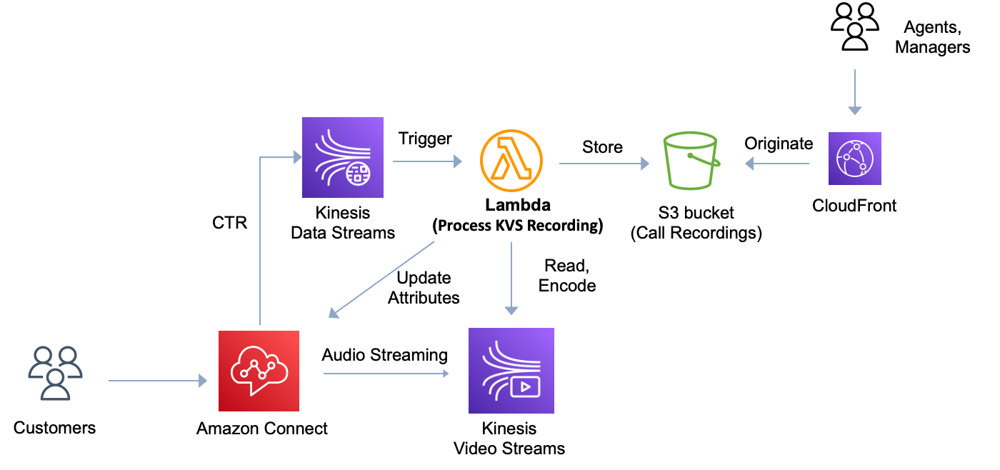

# Sample Comprehensive Call Recording for Amazon Connect

Amazon Connect is an AI-powered omnichannel cloud contact center service from AWS. It's easy to use and can scale to any size based on customer needs, and is widely adopted across industries and organizations of all sizes.

Amazon Connect has [native call recording capabilities](https://docs.aws.amazon.com/connect/latest/adminguide/set-up-recordings.html) that allow recording of agents only, customers only, or both agents and customers simultaneously. However, this feature only records conversations when connected to an agent; conversations before/after agent connection, or conversations without agent participation, are not recorded.

In real-world scenarios, there are many requirements for call recording without agent participation. For example, in call transfer scenarios where customer calls are forwarded to external numbers, or in notification scenarios where calls are made directly to customers to play voice messages. In these scenarios, call recording is often needed for purposes such as historical call tracking, customer sentiment analysis, and training using recordings.

This project customizes a comprehensive call recording solution for Amazon Connect using services such as Kinesis Video Streams (KVS), Kinesis Data Streams (KDS), and Lambda, and implements call recording whether an agent is involved or not.

The architecture diagram is as follows.



Amazon connect saves the call recording to KVS, lambda function parses CTRs(which include KVS audio information), read audio streams and store it to Amazon S3. Agents or managers can access audio files via CloudFront.

This project contains source code and supporting files for a serverless application that you can deploy with the SAM CLI. It includes the following files and folders.

- ProcessKvs/src/main - Code for the application's Lambda function.
- events - Invocation events that you can use to invoke the function.
- ProcessKvs/src/test - Unit tests for the application code.
- template.yaml - A template that defines the application's AWS resources.
- SampleFlows - Sample Amazon Connect flows.

## SAM Template Configurations

The application template uses AWS Serverless Application Model (AWS SAM) to define application resources. AWS SAM is an extension of AWS CloudFormation with a simpler syntax for configuring common serverless application resources such as functions, triggers, and APIs. For resources not included in [the SAM specification](https://github.com/awslabs/serverless-application-model/blob/master/versions/2016-10-31.md), you can use standard [AWS CloudFormation](https://docs.aws.amazon.com/AWSCloudFormation/latest/UserGuide/aws-template-resource-type-ref.html) resource types.

The application uses several AWS resources, including Lambda functions. These resources are defined in the `template.yaml` file.

### SAM Parameters

SAM Parameters in `template.yaml` file define variables which you must input when deploying the application using SAM CLI.

```bash
Parameters:
  S3BucketName:
    Type: String
    Description: Recordings Bucket Name
  S3BucketPrefix:
    Type: String
    Default: recordings/
    Description: Recordings Key Prefix, such as recordings/
  CloudFrontDomain:
    Type: String
    Description: CloudFront Distribution
```

### Lambda Execution Role policies

The lambda need to read audio streams from KVS, uploads voice recording files to S3. So corresponding permissions need to be configured in template.yaml. We define `S3BucketName` and `S3BucketPrefix` in Parameters section.

```bash
Policies:
  - AmazonKinesisVideoStreamsReadOnlyAccess
  - AmazonKinesisReadOnlyAccess
  - Statement:
      - Sid: AmazonS3Access
        Effect: Allow
        Action:
          - s3:PutObject
          - s3:GetObject
        Resource: !Sub 'arn:${AWS::Partition}:s3:::${S3BucketName}/${S3BucketPrefix}*'
  - Statement:
    - Sid: UpdateAmazonConnectContactAttributes
      Effect: Allow
      Action:
        - connect:UpdateContactAttributes
      Resource: !Sub 'arn:${AWS::Partition}:connect:${AWS::Region}:${AWS::AccountId}:instance/*/contact/*'
```

### Lambda Environment variables

Some Lambda environment variables need to be set to run the Lambda properly. `REGION` is used for where Amazon Connect is running, `RECORDINGS_BUCKET_NAME` is for the S3 bucket in which the voice recording will be uploaded, `RECORDINGS_KEY_PREFIX` for the S3 prefix of voice recordings. `CLOUDFRONT_DOMAIN` for CloudFront distribution allowing users to publicly access audio files in S3 bucket.
Lambda environment variables automatically reference parameters defined before. You shouldn't need to change them.

```bash
Environment: # More info about Env Vars: https://github.com/awslabs/serverless-application-model/blob/master/versions/2016-10-31.md#environment-object
  Variables:
    JAVA_TOOL_OPTIONS: -XX:+TieredCompilation -XX:TieredStopAtLevel=1 # More info about tiered compilation https://aws.amazon.com/blogs/compute/optimizing-aws-lambda-function-performance-for-java/
    REGION: !Ref AWS::Region
    RECORDINGS_BUCKET_NAME: !Ref S3BucketName
    RECORDINGS_KEY_PREFIX: !Ref S3BucketPrefix
    START_SELECTOR_TYPE: FRAGMENT_NUMBER
    CLOUDFRONT_DOMAIN: !Ref CloudFrontDomain
```

## Deploy the application

The Serverless Application Model Command Line Interface (SAM CLI) is an extension of the AWS CLI that adds functionality for building and testing Lambda applications. It uses Docker to run your functions in an Amazon Linux environment that matches Lambda. It can also emulate your application's build environment and API.

To use the SAM CLI, you need the following tools.

* SAM CLI - [Install the SAM CLI](https://docs.aws.amazon.com/serverless-application-model/latest/developerguide/serverless-sam-cli-install.html)
  java17 - [Install the Java 17](https://docs.aws.amazon.com/corretto/latest/corretto-17-ug/downloads-list.html)
* Docker - [Install Docker community edition](https://hub.docker.com/search/?type=edition&offering=community)

To build and deploy your application for the first time, run the following in your shell:

```bash
sam build
sam deploy --guided
```

The first command will build the source of your application. The second command will package and deploy your application to AWS, with a series of prompts:

* **Stack Name**: The name of the stack to deploy to CloudFormation. This should be unique to your account and region, and a good starting point would be something matching your project name.
* **AWS Region**: The AWS region you want to deploy your app to.
* **Parameter S3BucketName**: The S3 bucket in which the voice recordings will be uploaded.
* **Parameter S3BucketPrefix** [recordings/]: The S3 prefix of voice recordings.
* **Parameter CloudFrontDomain**: CloudFront distribution allowing users to publicly access audio files in S3 bucket
* **Confirm changes before deploy**: If set to yes, any change sets will be shown to you before execution for manual review. If set to no, the AWS SAM CLI will automatically deploy application changes.
* **Allow SAM CLI IAM role creation**: Many AWS SAM templates, including this example, create AWS IAM roles required for the AWS Lambda function(s) included to access AWS services. By default, these are scoped down to minimum required permissions. To deploy an AWS CloudFormation stack which creates or modifies IAM roles, the `CAPABILITY_IAM` value for `capabilities` must be provided. If permission isn't provided through this prompt, to deploy this example you must explicitly pass `--capabilities CAPABILITY_IAM` to the `sam deploy` command.
* **Save arguments to samconfig.toml**: If set to yes, your choices will be saved to a configuration file inside the project, so that in the future you can just re-run `sam deploy` without parameters to deploy changes to your application.

You can find your Lambda function in the output values displayed after deployment.

## Import Amazon Connect contact flow

The sample Amazon Connect contact flows are placed in the `SampleFlows` folder in this project. You can import them to Amazon Connect for testing.

## Use the SAM CLI to build and test locally

Build your application with the `sam build` command.

```bash
AmazonConnectCallRecording$ sam build
```

The SAM CLI installs dependencies defined in `ProcessKvs/build.gradle`, creates a deployment package, and saves it in the `.aws-sam/build` folder.

Test a single function by invoking it directly with a test event. An event is a JSON document that represents the input that the function receives from the event source. Test events are included in the `events` folder in this project.

Run functions locally and invoke them with the `sam local invoke` command.

```bash
AmazonConnectCallRecording$ sam local invoke AmazonConnectCallRecording --event events/kinesis-event.json
```

## Add a resource to your application

The application template uses AWS Serverless Application Model (AWS SAM) to define application resources. AWS SAM is an extension of AWS CloudFormation with a simpler syntax for configuring common serverless application resources such as functions, triggers, and APIs. For resources not included in [the SAM specification](https://github.com/awslabs/serverless-application-model/blob/master/versions/2016-10-31.md), you can use standard [AWS CloudFormation](https://docs.aws.amazon.com/AWSCloudFormation/latest/UserGuide/aws-template-resource-type-ref.html) resource types.

## Fetch, tail, and filter Lambda function logs

To simplify troubleshooting, SAM CLI has a command called `sam logs`. `sam logs` lets you fetch logs generated by your deployed Lambda function from the command line. In addition to printing the logs on the terminal, this command has several nifty features to help you quickly find the bug.

`NOTE`: This command works for all AWS Lambda functions; not just the ones you deploy using SAM.

```bash
AmazonConnectCallRecording$ sam logs -n AmazonConnectCallRecording --stack-name AmazonConnectCallRecording --tail
```

You can find more information and examples about filtering Lambda function logs in the [SAM CLI Documentation](https://docs.aws.amazon.com/serverless-application-model/latest/developerguide/serverless-sam-cli-logging.html).

## Cleanup

To delete the application that you created, use the AWS CLI. Assuming you used your project name for the stack name, you can run the following:

```bash
sam delete --stack-name AmazonConnectCallRecording
```
